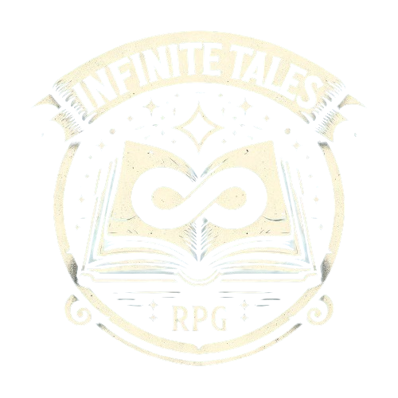

<h1 align="center">Infinite Tales RPG</h1>

<p align="center">
  
</p>

**Infinite Tales RPG** is an interactive, choose-your-own-adventure RPG where the story is dynamically generated by AI. Immerse yourself in endless adventures, with each choice shaping the narrative in unique and exciting ways. The game shines by adding typical role playing mechanics.

### ⚔️ RPG mechanics
##### In development
- **Character Stats**
- **Dice rolls**
- **Skills and Abilities**
- **Character Progression**
- **Combat System**


### 🚀 Beta Release

**Infinite Tales RPG** is currently in Beta. Especially the  RPG mechanics are far from complete.
I appreciate your feedback to improve the game experience!

### 🎮 Start playing

To play **Infinite Tales RPG**, you'll need to set up your own Google Gemini API Key. Don't worry, it is free! **Hint:** Certain Browsers support a VPN add-on.

You can access the game with the following link. The game uses the pollinations.ai LLM backend, so no API key is required!

https://infinite-tales-rpg.vercel.app/


## 📝 License

The game is open source and contributions are very welcome! You are free to fork, but commercial use is heavily discouraged.

This project is licensed under the GNU AGPLv3 License - see the [LICENSE](LICENSE) file for details.

## 🛠️ Tech Stack

- **Mobile first development!**
- **Framework**: SvelteKit
- **UI Components**: Svelte 5
- **Styling**: Tailwind CSS, DaisyUI

## 🤝 Contributing

Contributions are welcome! There are no contribution guidelines yet.
Open an issue so we can discuss.


## 🤓 Start developing

To develop **Infinite Tales RPG**, you'll need to set up a few things:

### Prerequisites

1. **Node.js & npm**: Make sure you have Node.js and npm installed. You can download them [here](https://nodejs.org/).

### Setting Up the Project

1. **Clone the repository**:
    ```bash
    git clone https://github.com/JayJayBinks/infinite-tales-rpg
    cd infinite-tales-rpg
    ```

2. **Install dependencies**:
    ```bash
    npm install
    ```

3. **Run the development server**:
    ```bash
    npm run dev
    ```

## 🎉 Acknowledgements

- Many thanks to the developers of Svelte, Tailwind CSS, and DaisyUI for their amazing tools.
- Special thanks to the prompt magicians of <a class="link" href="https://www.rpgprompts.com/" target="_blank">rpgprompts</a>, this game is run on your prompt!
- The amazing image generation is done by <a href="https://pollinations.ai/" target="_blank">pollinations.ai</a>
- The cool dice rolling feature is developed here <a class="link" href="https://github.com/3d-dice/dice-box" target="_blank">3d-dice dice-box</a>
- Favicon is created by <a href="https://icons8.com" target="_blank">icons8.com</a>