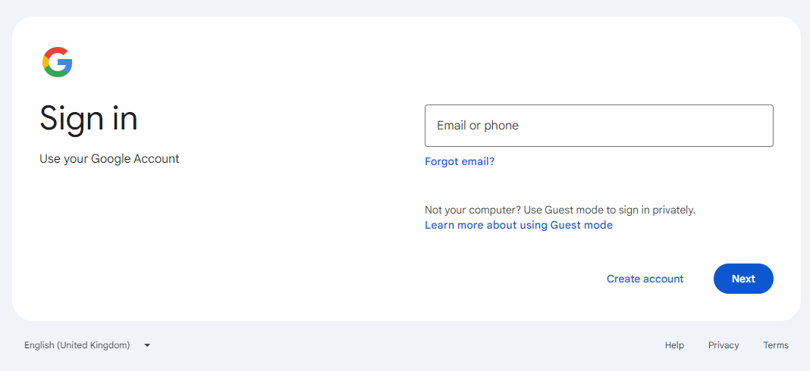
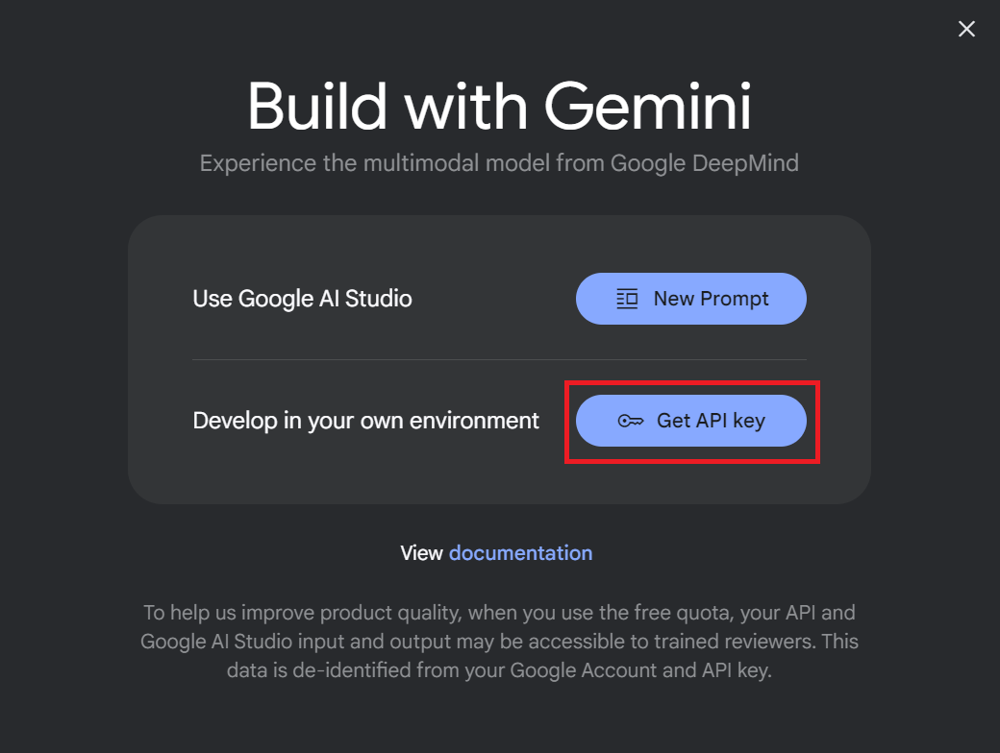
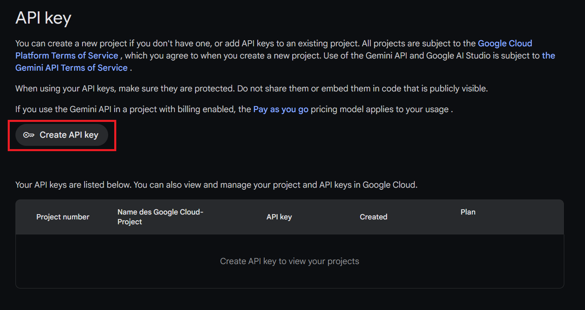
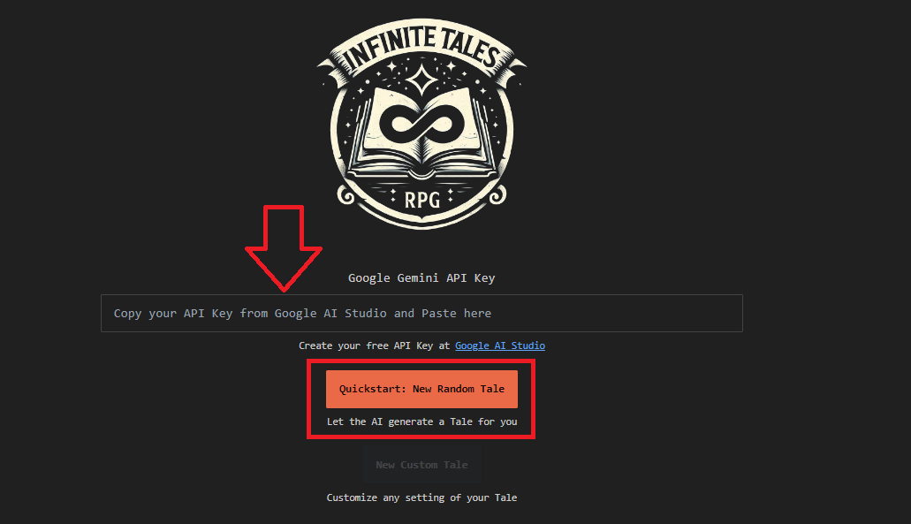

## Get your free Google Gemini API Key 🔑

Just follow the instructions below. You will need a Google account.
There is currently NO COST to use the Gemini 1.5 flash model for limited use. See [details here](https://ai.google.dev/pricing)

Detailed Instructions

1. Go to [Google AI Studio](https://aistudio.google.com/app/apikey) and login to your Google account if needed

2. Go to Google AI Studio, read & consent to the **Terms of Service** and press **Continue**  

3. On the Build with Gemini screen click **"Get API key"**

4. Click **"Create API key"** on the main part of the page  

5. Click **"Create API Key in new project"** and wait while Google generates your key  
  

6. Press the **"Copy"** button to copy your key  
   

7. Paste it into the **[Infinite Tales RPG](https://infinite-tales-rpg.vercel.app/game/settings/ai) settings page**
   

8. Click on **"Quickstart: New Random Tale"** to let the AI create a new game for you.

That's it, you now have free and unlimited access to Infinite Tales RPG. 